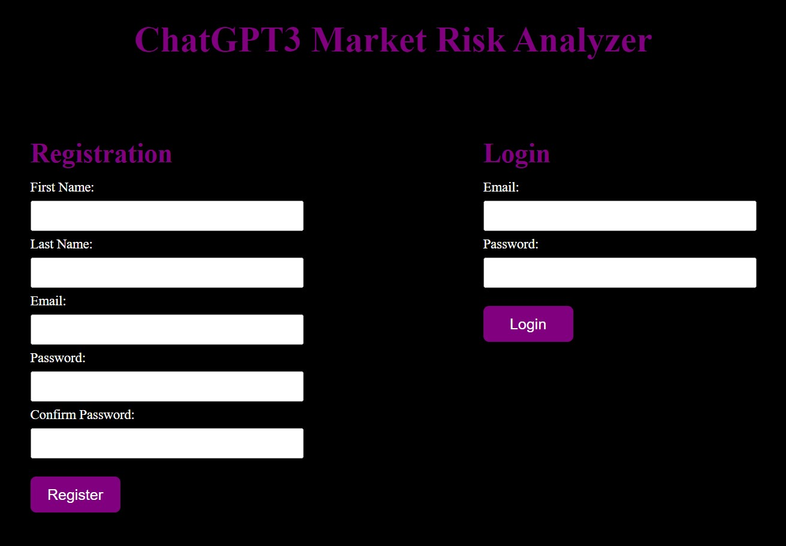

# ChatGPT3 Market Risk Analyzer

In this project, Python was utilized to develop a full-stack web application with ChatGPT3 for fine-tuning the AI model with 40 years of economic data. The application is designed to analyze the normal distribution of various datasets obtained from the FRED API.

## About

ChatGPT3 Market Risk Analyzer is a full-stack application developed using Python, Flask, OpenAI, FredAP, Pandas, NumPy, jsonlines, CSV, Bcrypt, Plotly, PyMySQL, and RegEx. The application fine-tunes ChatGPT3 on 40 years of economic data using nine datasets found on the FRED API. A normal distribution algorithm was engineered to categorize each data point into eight percentile ranges. The ChatGPT3 Curie model was fine-tuned using both original economic data and normal distribution categorizations, achieving a high accuracy rate in predicting the monthly normal distribution category for novel data points across all nine datasets.

## Technologies Used
- Python
- Flask
- OpenAI's ChatGPT3
- FredAP
- Pandas
- NumPy
- jsonlines
- CSV
- Bcrypt
- Plotly
- PyMySQL
- RegEx

## Key Features
- Fine-tuning of ChatGPT3 on economic data
- Normal distribution algorithm for categorization of data points
- Backend functionalities for saving and retrieving data, creating charts, fetching economic data, and more

## Source Code
GitHub Repository: https://github.com/njoyedevs/ChatGPT3_RiskAnalyzer

## Skills Highlight
- Artificial Intelligence (AI)
- Web Development
- Programming
- Software Development
- Data Structures
- SQL
- Flask
- ChatGPT3
- Data Visualization
- Statistical Data Analysis
- Pandas (Software)
- NumPy
- Python (Programming Language)
- Web Applications

## Tour of the Application 

1. Secure Login & Registration Screen using Bcrypt

2. Data Entry Screen Where User Can Enter Real or Mock Data Points

3. Market Risk Report with Custom Guage and Design

4. ChatGPT3 Retrain Confirmation Message

For more detailed instructions and additional information, please refer to the project's GitHub repository.
